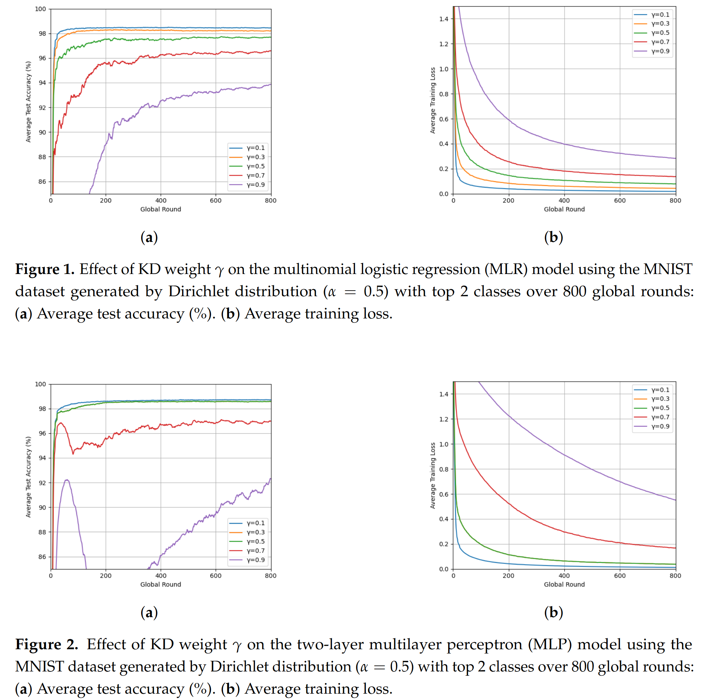
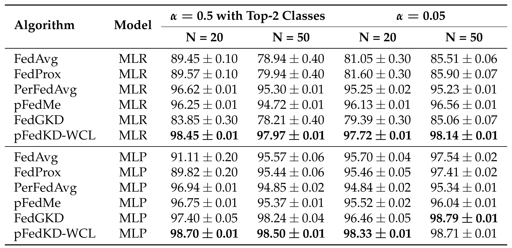
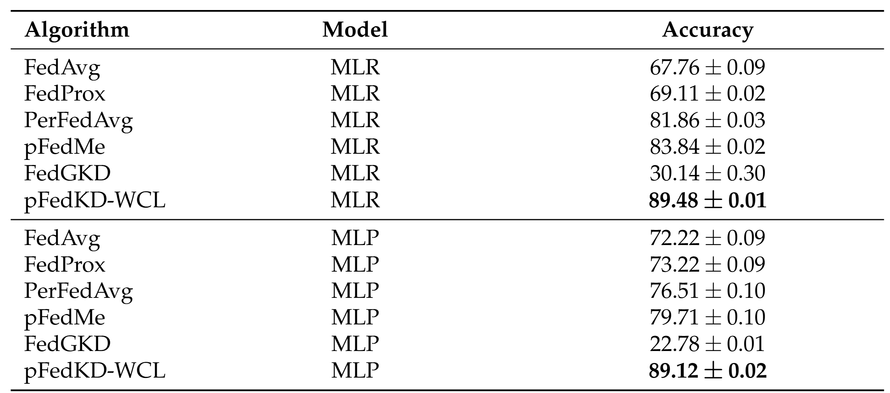

# A Novel Algorithm for Personalized Federated Learning: Knowledge Distillation with Weighted Combination Loss
This repository produces all experiments in the paper **A Novel Algorithm for Personalized Federated Learning: Knowledge Distillation with Weighted Combination Loss**

Full paper: https://www.mdpi.com/1999-4893/18/5/274

# Datasets 
## Image classification: MNIST and Synthetic
- Generating Non-IID MNIST data: Following the approach suggested by Hsu et al., we generated non-IID settings across clients using a Dirichlet distribution with parameter $ \alpha $, and we evaluated two non-IID settings, each with 20 and 50 clients. 
    - Generate MNIST data by running 'MNIST_dirichlet.py'
    - Setting 1: Dirichlet distribution with $\alpha=0.05$
    - Setting 2: Dirichlet distribution with $\alpha=0.5$, selects the top two classes with the highest proportions, ensuring each client holds data for exactly two digits. 
- Generating Non-IID Synthetic data: The synthetic dataset was generated following the methodology of Li et al. It consists of 100 clients for each client.
    - Generate Synthetic data by running 'synthetic.py'

# Experiments and Results
A main file 'main.py' performs all experiments in the paper.  
We compared the empirical performance of our method with that of FedAvg, FedProx, PerFedAvg, pFedMe and FedGKD. 
## Effect of the Hyperparameter
First, we evaluated the effect of the KD weight parameter $ \gamma $ in our algorithm, we conducted experiments on the MNIST data with top two classes per client for two models: a MLR model and a MLP model with $ \gamma = 0.1, 0.3, 0.5, 0.7, 0.9$. 
- run commonds below by specifying '--kd_weight' for different $\gamma$ and '--model' for different model
<pre><code>
python main.py --algorithm pfedkd --dataset mnist --alpha_diric 0.5 --n_clients 20 --model mlr --rounds 800 --local_epochs 20 --batch_size 20 --learning_rate 0.01 --kd_weight 0.1 --c 0.25 --sim_n 10
</code></pre>

## Test accuracy comparison on MNIST
This table summarizes the average test accuracy after 600 training rounds across two non-IID settings of the MNIST dataset with fine-tuned hyperparameters.
- run commonds below by specifying '--model' for different model
- MLR model:
    - $\alpha = 0.5$ with top two classes:
    <pre><code>
    python main.py --algorithm pfedkd --dataset mnist --alpha_diric 0.5 --n_clients 20 --model mlr --rounds 600 --local_epochs 20 --batch_size 20 --learning_rate 0.02 --kd_weight 0.1 --c 0.25 --sim_n 10
    python main.py --algorithm pfedkd --dataset mnist --alpha_diric 0.5 --n_clients 50 --model mlr --rounds 600 --local_epochs 20 --batch_size 20 --learning_rate 0.02 --kd_weight 0.1 --c 0.25 --sim_n 10
    </code></pre>
    - $\alpha = 0.05$: 
    <pre><code>
    python main.py --algorithm pfedkd --dataset mnist --alpha_diric 0.05 --n_clients 20 --model mlr --rounds 600 --local_epochs 20 --batch_size 20 --learning_rate 0.02 --kd_weight 0.1 --c 0.25 --sim_n 10
    python main.py --algorithm pfedkd --dataset mnist --alpha_diric 0.05 --n_clients 50 --model mlr --rounds 600 --local_epochs 20 --batch_size 20 --learning_rate 0.02 --kd_weight 0.1 --c 0.25 --sim_n 10
    </code></pre>
- MLP model: 
    - $\alpha = 0.5$ with top two classes:
    <pre><code>
    python main.py --algorithm pfedkd --dataset mnist --alpha_diric 0.5 --n_clients 20 --model mlp --rounds 600 --local_epochs 20 --batch_size 20 --learning_rate 0.02 --kd_weight 0.1 --c 0.25 --sim_n 10
    python main.py --algorithm pfedkd --dataset mnist --alpha_diric 0.5 --n_clients 50 --model mlp --rounds 600 --local_epochs 20 --batch_size 20 --learning_rate 0.02 --kd_weight 0.1 --c 0.25 --sim_n 10
    </code></pre>
    - $\alpha = 0.05$: 
    <pre><code>
    python main.py --algorithm pfedkd --dataset mnist --alpha_diric 0.05 --n_clients 20 --model mlp --rounds 600 --local_epochs 20 --batch_size 20 --learning_rate 0.02 --kd_weight 0.1 --c 0.25 --sim_n 10
    python main.py --algorithm pfedkd --dataset mnist --alpha_diric 0.05 --n_clients 50 --model mlp --rounds 600 --local_epochs 20 --batch_size 20 --learning_rate 0.02 --kd_weight 0.1 --c 0.25 --sim_n 10
    </code></pre>

## Test accuracy comparison on synthetic data
Similarly this table depicts the performance on the synthetic dataset using MLR and MLP models, respectively.
- MLR model:
<pre><code>
python main.py --algorithm pfedkd --dataset synthetic --alpha_diric 0.5 --n_clients 20 --model mlr --rounds 600 --local_epochs 20 --batch_size 20 --learning_rate 0.01 --kd_weight 0.1 --c 0.25 --sim_n 10
</code></pre>
- MLP model:
<pre><code>
python main.py --algorithm pfedkd --dataset synthetic --alpha_diric 0.5 --n_clients 20 --model mlp --rounds 600 --local_epochs 20 --batch_size 20 --learning_rate 0.01 --kd_weight 0.1 --c 0.25 --sim_n 10
</code></pre>

